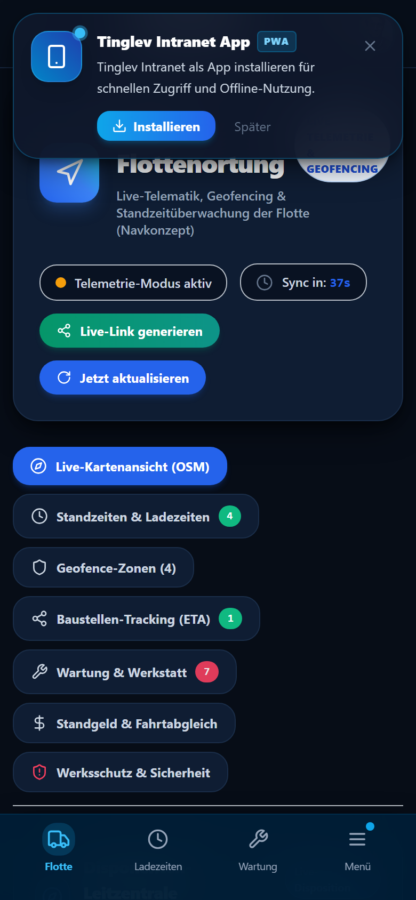
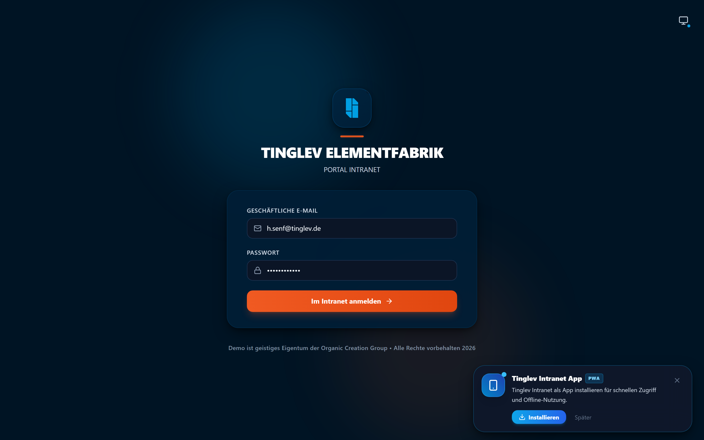
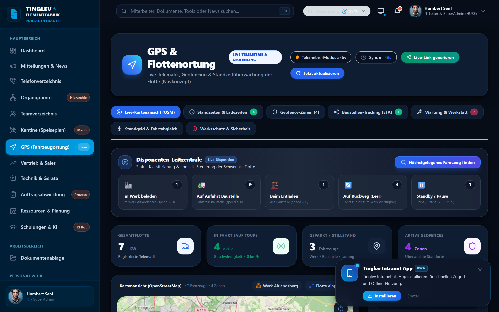
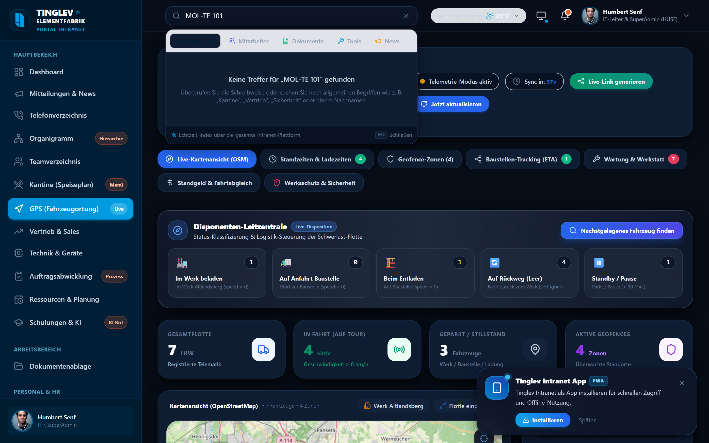
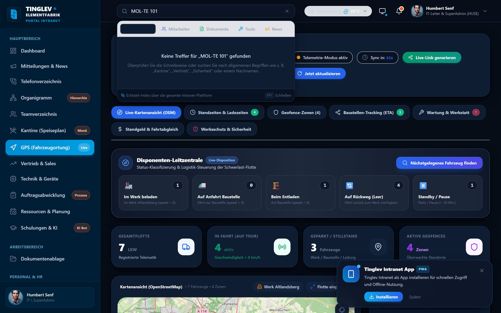
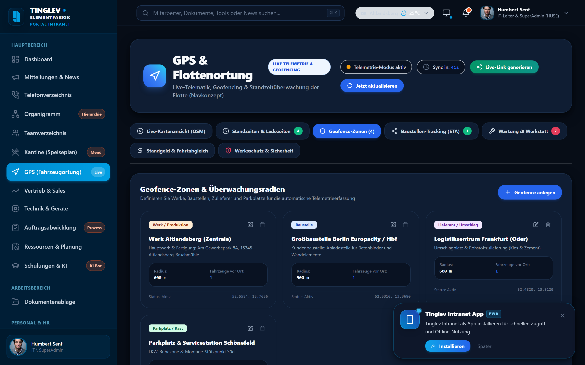
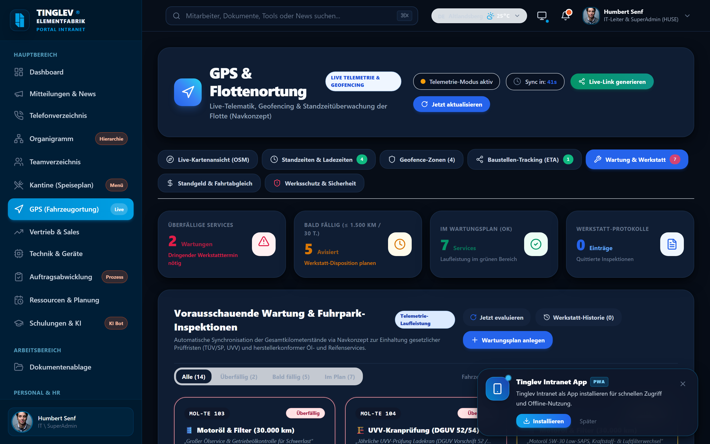
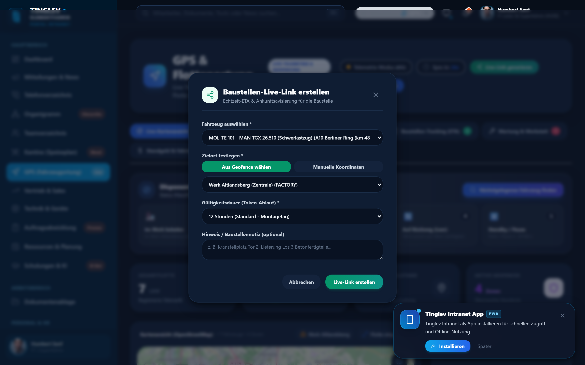
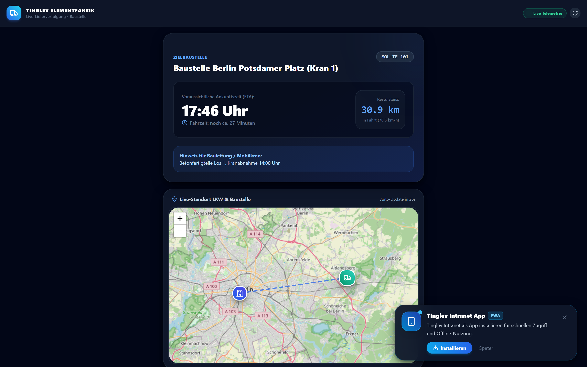

# Benutzerhandbuch: Tinglev Intranet & Fuhrpark-Portal
## Schritt-für-Schritt-Anleitung für Disposition, Fuhrparkleitung und Montageleiter

---

**Projekt:** Tinglev Intranet – Modul Fuhrpark & Logistik-Disposition  
**Dokumentenart:** Offizielles Anwenderhandbuch & Praxisleitfaden  
**Version:** 7.0  
**Gültig ab:** September 2026  
**Zielgruppe:** Disponenten, Fuhrparkleiter, Montageleiter, Bauleiter und Geschäftsführung  
**System:** Tinglev Elementfabrik Web-Portal & Mobile PWA  

---

## Inhaltsverzeichnis

1. [Über dieses Handbuch](#1-über-dieses-handbuch)
2. [Teil A: Schnellanleitung für Smartphones (PWA)](#teil-a-schnellanleitung-für-smartphones-pwa)
   - [Schritt A1: Die App als PWA auf dem Smartphone installieren](#schritt-a1-die-app-als-pwa-auf-dem-smartphone-installieren)
   - [Schritt A2: Mobile Navigation per Fingertipp](#schritt-a2-mobile-navigation-per-fingertipp)
   - [Schritt A3: Fahrzeugdetails im hochziehbaren Info-Fenster (Bottom Sheet)](#schritt-a3-fahrzeugdetails-im-hochziehbaren-info-fenster-bottom-sheet)
3. [Teil B: Leitfaden für Disposition & Fuhrparkleitung](#teil-b-leitfaden-für-disposition--fuhrparkleitung)
   - [Schritt B1: Anmeldung am Intranet-Portal](#schritt-b1-anmeldung-am-intranet-portal)
   - [Schritt B2: Die Flottenkarte im Überblick (Live-Ortung)](#schritt-b2-die-flottenkarte-im-überblick-live-ortung)
   - [Schritt B3: Fahrzeuge suchen und nach Fahrstatus filtern](#schritt-b3-fahrzeuge-suchen-und-nach-fahrstatus-filtern)
   - [Schritt B4: Die Lkw-Detailansicht (Seitenfenster / Drawer)](#schritt-b4-die-lkw-detailansicht-seitenfenster--drawer)
   - [Schritt B5: Standzeiten, Lade- und Entladezeiten überwachen (Geofencing)](#schritt-b5-standzeiten-lade--und-entladezeiten-überwachen-geofencing)
   - [Schritt B6: Wartungsampel & gesetzliche Prüffristen (TÜV, UVV, SP)](#schritt-b6-wartungsampel--gesetzliche-prüffristen-tüv-uvv-sp)
4. [Teil C: Baustellen-Koordination & Live-Lieferverfolgung](#teil-c-baustellen-koordination--live-lieferverfolgung)
   - [Schritt C1: Zeitlich befristeten Tracking-Link für Baustellen erstellen](#schritt-c1-zeitlich-befristeten-tracking-link-für-baustellen-erstellen)
   - [Schritt C2: Live-Link an Montageleiter und Kranführer weitergeben](#schritt-c2-live-link-an-montageleiter-und-kranführer-weitergeben)
   - [Schritt C3: Die Baustellen-Kundenansicht (ETA & Restzeit)](#schritt-c3-die-baustellen-kundenansicht-eta--restzeit)
5. [Teil D: Häufige Fragen & Praxistipps (FAQ)](#teil-d-häufige-fragen--praxistipps-faq)

---

## 1. Über dieses Handbuch

Herzlich willkommen im modernisierten **Tinglev Intranet** mit integriertem **Fuhrpark- und Logistik-Portal**. Dieses System wurde speziell entwickelt, um den Arbeitsalltag unserer Disponenten, Fuhrparkleiter und Montageleiter so einfach und transparent wie möglich zu gestalten.

### Ihre Vorteile im Arbeitsalltag:
- **Keine Zettelwirtschaft & kein Rätselraten:** Sie sehen sekundengenau auf einer interaktiven Karte, wo sich jeder Schwerlastzug und jedes Montagefahrzeug befindet.
- **Punktgenaue Kranplanung:** Baustellen und Montageleiter erhalten Live-Tracking-Links mit verlässlicher Ankunftszeit (ETA), sodass Mobilkräne nicht unnötig im Leerlauf warten.
- **Standzeit-Transparenz:** Automatische Erfassung von Ladezeiten im Werk Altlandsberg sowie Entladezeiten auf den Baustellen über virtuelle Werksgrenzen (Geofences).
- **Vorausschauende Sicherheit:** Gesetzliche Prüfungen (TÜV, Sicherheitsprüfung SP, UVV-Kranprüfung) und Serviceintervalle (Ölwechsel) werden rechtzeitig mit farbigen Warnstufen gemeldet.

> **Hinweis für Anwender ohne IT-Kenntnisse:**  
> Sie benötigen keine Programmierkenntnisse und müssen keine komplizierten Programme installieren. Die Anwendung öffnet sich einfach in Ihrem normalen Internet-Browser (Google Chrome, Microsoft Edge, Safari) am PC oder als praktische App auf Ihrem Smartphone.

---

# Teil A: Schnellanleitung für Smartphones (PWA)

---

### Schritt A1: Die App als PWA auf dem Smartphone installieren

Die Anwendung ist als sogenannte **Progressive Web App (PWA)** konzipiert. Das bedeutet: Sie können das Tinglev Intranet direkt aus dem Webbrowser wie eine vollwertige Smartphone-App auf Ihrem Startbildschirm ablegen – ganz ohne App Store.

#### Was sehe ich auf dem Smartphone?
- Beim ersten Öffnen der Webadresse im mobilen Browser erscheint am unteren Rand ein blauer Hinweisbalken: *"Tinglev Intranet zum Startbildschirm hinzufügen"*.

#### Wo muss ich tippen?
1. **Auf Android-Smartphones (Google Chrome):**
   - Tippen Sie im Hinweisbalken direkt auf **"Installieren"** bzw. **"Zum Startbildschirm"**.
   - Falls der Balken nicht sichtbar ist: Tippen Sie oben rechts auf das **3-Punkte-Menü (⋮)** und wählen Sie **"App installieren"** oder **"Zum Startbildschirm hinzufügen"**.
2. **Auf Apple iPhones / iPads (Safari):**
   - Tippen Sie in der unteren Safari-Leiste auf das **Teilen-Symbol** (Quadrat mit Pfeil nach oben ⎋).
   - Scrollen Sie im Menü nach unten und wählen Sie **"Zum Home-Bildschirm"** (+).
   - Tippen Sie oben rechts auf **"Hinzufügen"**.
3. Auf Ihrem Handy-Startbildschirm erscheint nun das vertraute blau-orange **Tinglev-Symbol**. Ein Antippen öffnet das Portal blitzschnell im Vollbildmodus ohne störende Browserleisten.

> **Praxistipp für Bauleiter:**  
> Das App-Symbol auf dem Smartphone startet die Anwendung sofort und speichert Ihren Login. So können Sie auch mit Montagehandschuhen direkt auf der Baustelle den aktuellen Standort des Betonteile-Transporters prüfen.

---

### Schritt A2: Mobile Navigation per Fingertipp

Die mobile Benutzeroberfläche passt sich automatisch an kleinere Smartphone-Bildschirme an und ermöglicht eine bequeme Einhand-Bedienung.

#### Was sehe ich auf diesem Bildschirm?
- **Kopfzeile:** Das Tinglev-Firmenlogo, den Seitentitel und eine Glocke für dringende Fuhrpark- und Systemhinweise.
- **Kartenbereich:** Die gestochen scharfe Straßenkarte mit allen aktiven Transportern im Großraum Berlin/Brandenburg.
- **Fahrzeug-Marker:** Große, gut lesbare Fahrzeugsymbole. Ein pulsierender grüner Kreis signalisiert ein rollendes Fahrzeug; ein blaues Symbol zeigt einen abgestellten Lkw.
- **Navigationsleiste am unteren Rand:** Schneller Wechsel zwischen *Karte*, *Fahrzeugliste*, *Standzeiten* und *Wartung*.

#### Wo muss ich tippen?
- **Zoom & Verschieben:** Mit zwei Fingern auf der Karte zusammen- oder auseinanderziehen, um den Kartenausschnitt zu vergrößern. Mit einem Finger wischen, um die Karte zu verschieben.
- **Standort zentrieren:** Tippen Sie oben rechts auf das **Fadenkreuz-Symbol (⌖)**, um die Karte sofort auf Ihren aktuellen GPS-Standort zu zentrieren.
- **Fahrzeug auswählen:** Tippen Sie direkt auf einen Fahrzeug-Marker (z. B. `MOL-TE 101`), um sofort alle Fahrdaten zu öffnen.

---

### Schritt A3: Fahrzeugdetails im hochziehbaren Info-Fenster (Bottom Sheet)

Tippen Sie auf dem Smartphone auf ein Fahrzeug, fährt von unten ein elegantes Informationsfenster (Bottom Sheet) nach oben.

#### Was sehe ich auf diesem Bildschirm?
- **Kopfbereich des Sheets:** Amtliches Kennzeichen (z. B. `MOL-TE 101`), Fahrzeugtyp (`MAN TGX 26.510 Schwerlastzug`) und Status-Plakette (*"In Fahrt – 78 km/h"* oder *"Im Werk Altlandsberg"*).
- **Echtzeit-Telemetrie:**
  - **Geschwindigkeit:** Große Ziffernanzeige in Kilometern pro Stunde (km/h).
  - **Aktuelle Position / Adresse:** Vollständige Straßenadresse mit Hausnummer, Postleitzahl und Ort.
  - **Fahrtrichtung:** Kompassanzeige mit Himmelsrichtung (z. B. *"Nordost (45°)"*).
  - **Letzte Positionsmeldung:** Zeitstempel der GPS-Übertragung (z. B. *"vor 12 Sekunden"*).
- **Schnellaktionen-Buttons:**
  - 📞 **Fahrer anrufen:** Wählt per Fingertipp die hinterlegte Mobilnummer des Fahrers.
  - 🔗 **Tracking-Link senden:** Öffnet direkt die Erstellung eines Baustellen-Freigabelinks.

#### Wo muss ich tippen?
1. **Details vergrößern:** Wischen Sie den grauen Haltegriff oben am Sheet mit dem Daumen weiter nach oben, um Tachostand und Wartungsstatus einzusehen.
2. **Sheet schließen:** Wischen Sie das Sheet mit einer kurzen Bewegung nach unten oder tippen Sie auf die freie Kartenfläche oben.

> **Praxistipp für die Baustelle:**  
> Über die Schaltfläche **"Fahrer anrufen"** können Sie ohne Suchen im Telefonbuch sofort Rücksprache halten, falls die Zufahrt zur Baustelle kurzfristig verlegt wurde.

---

# Teil B: Leitfaden für Disposition & Fuhrparkleitung

---

### Schritt B1: Anmeldung am Intranet-Portal

Am Desktop-PC in der Disposition starten Sie Ihren Arbeitstag über die zentrale Anmeldeseite des Intranets.

#### Was sehe ich auf diesem Bildschirm?
- Ein aufgeräumtes, dunkelblaues Anmeldefenster mit dem Tinglev Elementfabrik Firmenlogo.
- Zwei übersichtliche Eingabefelder: **"GESCHÄFTLICHE E-MAIL"** und **"PASSWORT"**.
- Ein Farbschema-Umschalter oben rechts (Wechsel zwischen hellem und dunklem Modus).
- Der blaue Hauptanmelde-Button mit Pfeilsymbol.

#### Wo muss ich klicken?
1. Klicken Sie in das Feld **Geschäftliche E-Mail** und geben Sie Ihre E-Mail-Adresse ein (z. B. `h.senf@tinglev.de` oder `dispo@tinglev.de`).
2. Klicken Sie in das Feld **Passwort** und tippen Sie Ihr persönliches Passwort ein.
3. Klicken Sie auf die blaue Schaltfläche **"Anmelden →"**.
4. Sie werden sofort zu Ihrer persönlichen Startseite weitergeleitet.

> **Praxistipp für den Arbeitsplatz:**  
> Ihr Browser fragt Sie beim ersten Login, ob das Passwort gespeichert werden soll. Klicken Sie auf *"Speichern"*, um sich morgens mit einem Klick ohne erneute Passworteingabe anzumelden.

---

### Schritt B2: Die Flottenkarte im Überblick (Live-Ortung)

Klicken Sie in der linken Hauptmenüleiste auf **"Fuhrpark & Logistik"** (oder `/gps`). Sie gelangen direkt auf die Flottenkarte.

#### Was sehe ich auf diesem Bildschirm?
- **Die große Live-Karte:** Im Zentrum sehen Sie die interaktive Landkarte. Alle Fahrzeuge der Tinglev-Flotte sind als farbige Symbole eingezeichnet:
  - 🟢 **Grünes pulsierendes Lkw-Symbol:** Fahrzeug ist in Bewegung (Geschwindigkeit > 0 km/h).
  - 🔵 **Blaues Lkw-Symbol:** Fahrzeug steht / parkt (Zündung aus oder Pause).
  - 🟠 **Oranges Werks-Symbol:** Das Werksgelände von Tinglev in Altlandsberg (Hauptzentrale) mit farblich markiertem Schutzperimeter (Geofence).
- **Die linke Seitenleiste:** Eine vollständige Liste aller Fahrzeuge sortiert nach Betriebszustand mit Kennzeichen, Fahrzeugbezeichnung, aktueller Geschwindigkeit und dem letzten gemeldeten Aufenthaltsort.
- **Die Status-Kopfzeile:**
  - Zähler für aktive Transporter (z. B. *"5 Fahrzeuge online | 3 in Fahrt"*).
  - Automatischer Aktualisierungs-Countdown (aktualisiert die GPS-Daten alle 45 Sekunden selbstständig).
  - Schaltfläche 🔄 **"Jetzt aktualisieren"** für sofortigen Datenabruf.

#### Wo muss ich klicken?
1. **Fahrzeug auf der Karte anvisieren:** Klicken Sie in der linken Liste auf ein Kennzeichen (z. B. `MOL-TE 101`). Die Karte fliegt automatisch zu diesem Transporter und öffnet die Detailkarte.
2. **Kartenansicht wechseln:** Über die Ebenen-Schaltfläche oben rechts auf der Karte können Sie zwischen Straßenkarte, Satellitenansicht und Geländemodus umschalten.

---

### Schritt B3: Fahrzeuge suchen und nach Fahrstatus filtern

Wenn Sie gezielt nach einem Transporter suchen oder nur Fahrzeuge sehen wollen, die sich gerade auf der Autobahn befinden, nutzen Sie die praktischen Schnellfilter.

#### Was sehe ich auf diesem Bildschirm?
- **Das Suchfeld:** Ein weißes Texteingabefeld mit Lupensymbol oben in der linken Seitenleiste (*"Kennzeichen oder Fahrer suchen..."*).
- **Die Status-Filterchips:** Vier farbige Auswahlschaltflächen:
  - **[Alle]**: Zeigt den gesamten Fuhrpark (Schwerlaster, Pritschenwagen, Servicefahrzeuge).
  - **[In Fahrt]**: Filtert sofort auf alle Lkw, die aktuell auf Achse sind.
  - **[Im Werk]**: Zeigt alle Fahrzeuge, die sich innerhalb des Geofence-Perimeters in Altlandsberg befinden.
  - **[Geparkt / Standby]**: Zeigt stehende Fahrzeuge (z. B. über Nacht oder bei Ruhezeiten).

#### Wo muss ich klicken?
1. **Gezielte Kennzeichen-Suche:** Klicken Sie in das Suchfeld und tippen Sie die ersten Ziffern des Kennzeichens ein (z. B. `101`). Bereits beim Tippen filtert sich die Liste in Echtzeit.
2. **Status-Filter anwenden:** Klicken Sie auf den Chip **"In Fahrt"**. Die Liste und die Marker auf der Karte reduzieren sich sofort auf alle rollenden Einheiten.
3. **Filter zurücksetzen:** Klicken Sie auf den Chip **"Alle"** oder löschen Sie den Text im Suchfeld über das kleine **(✕)**-Symbol.

> **Praxistipp für Disponenten:**  
> Nutzen Sie den Filter **"Im Werk"** morgens um 06:00 Uhr: Sie sehen sofort auf einen Blick, welche Sattelzüge bereits zur Beladung im Werk Altlandsberg bereitstehen.

---

### Schritt B4: Die Lkw-Detailansicht (Seitenfenster / Drawer)

Für tiefergehende Informationen zu einem einzelnen Transporter klicken Sie auf ein Fahrzeug in der Liste. Von rechts klappt ein umfassendes Informationsfenster aus.

#### Was sehe ich auf diesem Bildschirm?
- **Fahrzeug-Stammdaten:** Kennzeichen (`MOL-TE 101`), Interne Wagennummer (`#101`), Fahrzeugmodell (`MAN TGX 26.510 Schwerlast-Sattelzug`), zulässiges Gesamtgewicht und Fahrgestellnummer (FIN).
- **Standort- und Fahrtdaten:**
  - **Exakte Straßenadresse:** z. B. *"Berliner Ring A10, Höhe Ausfahrt 4 Bruchmühle"*.
  - **GPS-Koordinaten:** Breitengrad und Längengrad mit 4 Nachkommastellen.
  - **Aktuelle Geschwindigkeit & Tempomat:** Geschwindigkeit in km/h.
  - **Gesamtlaufleistung (Tachostand):** z. B. `184.230 km`.
- **Fahrten-Historie des Tages:** Eine chronologische Liste der heute angefahrenen Stationen mit Ankunfts-, Abfahrts- und Pausenzeiten.
- **Aktionsleiste am unteren Fensterrand:**
  - 🔗 **"Tracking-Link erstellen"**: Öffnet den Freigabedialog für Baustellen.
  - 🔧 **"Wartungseintrag erfassen"**: Dokumentiert Werkstattaufenthalte oder Reparaturen.
  - ❌ **"Schließen"**: Schließt das Seitenfenster wieder.

#### Wo muss ich klicken?
1. Klicken Sie auf **"Fahrtverlauf anzeigen"**, um die gefahrene Route des Transporters als blaue Linie auf der Karte nachzuvollziehen.
2. Klicken Sie auf das blaue Symbol **"Tracking-Link erstellen"**, um eine Live-Freigabe für einen Bauleiter zu starten.

---

### Schritt B5: Standzeiten, Lade- und Entladezeiten überwachen (Geofencing)

Um zu prüfen, ob Lkw zu lange im Werk auf die Beladung warten oder auf der Baustelle im Entladestau stehen, nutzen Sie das Register **"Standzeiten & Geofencing"**.

#### Was sehe ich auf diesem Bildschirm?
- **Geofence-Zonen-Übersicht:**
  - 🏭 **Werk Altlandsberg (Zentrale):** Ladezone für Fertigteile und Deckenplatten.
  - 🏗️ **Großbaustellen:** Automatisch eingerichtete Zonen für aktive Bauprojekte (z. B. Europacity Berlin, Frankfurt Oder, Potsdam).
- **Standzeit-Kennzahlen (KPIs):**
  - *Durchschnittliche Ladezeit im Werk* (z. B. `48 Minuten`).
  - *Durchschnittliche Entladezeit auf Baustellen* (z. B. `35 Minuten`).
  - *Aktuell im Werk anwesende Fahrzeuge* mit exakter Verweildauer (z. B. *"MOL-TE 102 – seit 1 Std. 14 Min."*).
- **Farbkodierte Verweildauer-Warnungen:**
  - 🟢 **Normal (unter 60 Min.):** Regulärer Lade-/Entladevorgang im Zeitplan.
  - 🟠 **Verzögert (60–120 Min.):** Mögliche Verzögerung bei der Kranentladung.
  - 🔴 **Kritisch (> 120 Min.):** Standzeit überschritten; Disponent sollte die Baustelle kontaktieren.

#### Wo muss ich klicken?
1. Klicken Sie oben in der Reiterleiste auf **"Standzeiten & Geofences"**.
2. Wählen Sie über das Datumsfeld den gewünschten Auswertetag aus (z. B. *Heute* oder *Gestern*).
3. Klicken Sie auf **"Excel-Bericht exportieren"**, um die Standzeiten für Nachkalkulationen oder Standgeld-Abrechnungen herunterzuladen.

> **Praxistipp für Fuhrparkleiter:**  
> Farbige Warnungen ab 60 Minuten Standzeit helfen Ihnen, Standgeld-Ansprüche gegenüber Auftraggebern lückenlos mit minutengenauen Ein- und Ausfahrtsprotokollen zu belegen.

---

### Schritt B6: Wartungsampel & gesetzliche Prüffristen (TÜV, UVV, SP)

Damit kein Fahrzeug wegen abgelaufener Prüfplaketten stillgelegt werden muss, überwacht das System alle Fristen und Kilometerstände vollautomatisch.

#### Was sehe ich auf diesem Bildschirm?
- **Vier große Service-Kacheln mit Ampelsystem:**
  - 📋 **TÜV-Hauptuntersuchung & SP (Sicherheitsprüfung):** Gesetzliche Prüffrist für Schwerlast-Fahrzeuge.
  - 🏗️ **UVV-Kranprüfung (DGUV Vorschrift 52/54):** Prüfung für Lkw-Ladekräne und Hebezeuge.
  - 🛢️ **Motoröl- & Filterservice:** Wartung nach Herstellervorgabe alle 30.000 km.
  - 🛞 **Reifenservice & Bremsenprüfung:** Zustandskontrolle vor der Wintersaison.
- **Die 3 farbigen Warnstufen:**
  - 🔴 **ROT / ÜBERFÄLLIG:** Frist oder Kilometerstand bereits überschritten! Sofortige Werkstattterminierung erforderlich.
  - 🟡 **GELB / BALD FÄLLIG:** Prüfung steht innerhalb der nächsten 30 Tage oder 2.500 km an.
  - 🟢 **GRÜN / ALLES IN ORDNUNG:** Gültige Prüfplakette, nächster Service in weiter Ferne.

#### Wo muss ich klicken?
1. Klicken Sie oben auf den Reiter **"Wartung & Prüffristen"**.
2. Klicken Sie auf den Filter **"Überfällig / Bald fällig"**, um nur die Fahrzeuge anzuzeigen, die demnächst in die Werkstatt müssen.
3. Klicken Sie in der Zeile eines durchgeführten Services auf die Schaltfläche **"✓ Service quittieren"**.
4. Geben Sie das neue Prüfdatum (z. B. *September 2027*) und den aktuellen Kilometerstand ein und klicken Sie auf **"Speichern"**. Die Ampel springt sofort wieder auf Grün.

---

# Teil C: Baustellen-Koordination & Live-Lieferverfolgung

---

### Schritt C1: Zeitlich befristeten Tracking-Link für Baustellen erstellen

Wenn schwere Betonfertigteile zur Baustelle geliefert werden, muss vor Ort der Autokran pünktlich bereitstehen. Mit wenigen Klicks erstellen Sie einen sicheren, zeitlich befristeten Live-Tracking-Link.

#### Was sehe ich auf diesem Bildschirm?
- Ein übersichtliches Dialogfenster mit dem Titel **"Neuen Baustellen-Live-Link erstellen"**.
- **Fahrzeugauswahl:** Dropdown-Menü mit Kennzeichen und aktuellem Beladestatus.
- **Baustellen-Zielort:** Eingabefeld für den Namen der Baustelle (z. B. *"Europacity Berlin Baufeld 4"* oder *"Potsdamer Platz (Kran 1)"*).
- **Gültigkeitsdauer (Ablaufzeit):** Schieberegler oder Schnellauswahl (z. B. *4 Stunden*, *8 Stunden*, *12 Stunden* oder *24 Stunden*).
- **Lieferhinweise für den Montageleiter:** Textfeld für Bemerkungen (z. B. *"Beton-Wandelemente Los 1, Zufahrt Tor Süd"*).

#### Wo muss ich klicken?
1. Klicken Sie in der Fahrzeugliste oder Detailansicht auf **"Live-Link teilen"**.
2. Wählen Sie das Lieferfahrzeug aus.
3. Geben Sie den Namen der Baustelle ein.
4. Stellen Sie die Gültigkeit auf **"8 Stunden"** (der Link verfällt nach Ablauf der Frist automatisch).
5. Klicken Sie auf die blaue Schaltfläche **"🔗 Live-Link generieren"**.

---

### Schritt C2: Live-Link an Montageleiter und Kranführer weitergeben

Sobald der Link erzeugt wurde, stehen Ihnen verschiedene komfortable Weitergabe-Möglichkeiten zur Verfügung.

#### Was sehe ich auf diesem Bildschirm?
- Die grüne Erfolgsmeldung: *"Tracking-Link erfolgreich erstellt!"*.
- Das Web-Adressfeld mit dem sicheren Link (z. B. `https://intranet.tinglev.de/track/test-live-montage-2026`).
- **Drei Weitergabe-Schaltflächen:**
  - 📋 **"In Zwischenablage kopieren":** Kopiert den Link zum Einfügen in E-Mails oder Teams-Nachrichten.
  - 💬 **"Per SMS / WhatsApp teilen":** Öffnet direkt den Nachrichtendienst auf dem Smartphone zur Weiterleitung an den Bauleiter.
  - 📱 **"QR-Code anzeigen":** Zeigt einen QR-Code auf dem Bildschirm, der einfach vom Baustellen-Tablet abgescannt werden kann.

#### Wo muss ich klicken?
- Klicken Sie auf **"Link kopieren"** und fügen Sie ihn mit `Strg + V` in Ihre Lieferschein-Nachricht ein.
- Sie können den Link jederzeit vor Ablauf der Zeit mit einem Klick auf **"Freigabe widerrufen"** sofort sperren.

---

### Schritt C3: Die Baustellen-Kundenansicht (ETA & Restzeit)

Wenn der Montageleiter oder Kranführer den Link auf seinem Smartphone oder Tablet öffnet, sieht er eine maßgeschneiderte, reduzierte Spezialansicht.

#### Was sehe ich auf diesem Bildschirm?
- **Große Ankunfts-Kopfzeile (ETA):**
  - **Voraussichtliche Ankunft:** Große Zeitanzeige (z. B. *"17:39 Uhr"*).
  - **Verbleibende Fahrzeit:** Minutenanzeige (z. B. *"noch 27 Minuten"*).
  - **Restdistanz auf der Straße:** Kilometeranzeige (z. B. *"30.9 km verbleibend"*).
- **Die reduzierte Baustellen-Karte:**
  - 🚛 **Grüner Transporter:** Zeigt genau den Lkw, der die Fertigteile für dieses Bauvorhaben transportiert.
  - 🏗️ **Blaues Kran-Symbol:** Der genaue Abladeort auf der Baustelle.
  - **Streckenlinie:** Zeigt den berechneten Straßenverlauf zwischen Lkw und Baustelle.
- **Datenschutz & Sicherheit:** Der externe Empfänger sieht **ausschließlich** das für ihn relevante Lieferfahrzeug. Alle anderen Fahrzeuge der Flotte, Betriebsdaten und firmeninternen Preise bleiben streng verborgen.

#### Wo muss der Montageleiter klicken?
- Der Montageleiter muss **nirgends klicken**! Die Ansicht aktualisiert sich vollautomatisch alle 30 Sekunden im Hintergrund.
- Über die Schaltfläche **"📞 Disponent anrufen"** kann er bei Rückfragen zur Entladereihenfolge direkt die Zentrale in Altlandsberg anrufen.

> **Praxistipp für die Montagekoordination:**  
> Kranstandzeiten kosten bares Geld. Durch die minutengenaue ETA-Anzeige weiß der Kranführer genau, wann er den Haken vorbereiten muss, und teure Standzeiten des Mobilkrans werden vermieden.

---

# Teil D: Häufige Fragen & Praxistipps (FAQ)

---

### Q1: Was bedeutet es, wenn ein Fahrzeug auf der Karte grau dargestellt wird?
> **Antwort:**  
> Ein graues Fahrzeugsymbol signalisiert den Status **"Offline / Kein Empfang"**. Das bedeutet, dass der Transporter seit mehr als 15 Minuten keine neue GPS-Position übertragen hat (z. B. beim Parken in einer geschlossenen Halle, in einer Tiefgarage oder bei der Durchfahrt eines Funklochs).  
> **Was ist zu tun?** Sobald der Lkw das Gebäude verlässt und wieder Mobilfunkempfang hat, springt das Symbol vollautomatisch wieder auf Grün oder Blau.

---

### Q2: Wie installiere ich die Intranet-App auf einem neuen Firmenhandy?
> **Antwort:**  
> 1. Öffnen Sie auf dem Handy den Internet-Browser (Chrome oder Safari) und rufen Sie die Firmenadresse auf.  
> 2. Bei Android: Tippen Sie im Menü (3 Punkte) auf **"App installieren"**.  
> 3. Bei iPhone: Tippen Sie auf das Teilen-Symbol und wählen Sie **"Zum Home-Bildschirm"**.  
> Schon haben Sie die App mit eigenem Symbol auf dem Startbildschirm installiert.

---

### Q3: Wie aktualisiere ich die Anwendung, wenn neue Funktionen freigeschaltet wurden?
> **Antwort:**  
> Sie müssen keine Updates aus dem App Store herunterladen. Wenn eine neue Version bereitsteht, blendet die Anwendung automatisch einen kleinen blauen Hinweis ein: *"Neue Version verfügbar – Jetzt neu laden"*. Ein einfacher Klick darauf aktualisiert die App in einer Sekunde.

---

### Q4: Was passiert mit einem Baustellen-Tracking-Link, wenn die Lieferung abgeschlossen ist?
> **Antwort:**  
> Der Link verfällt automatisch nach Ablauf der von Ihnen eingestellten Zeit (z. B. nach 8 oder 12 Stunden). Danach sieht der externe Empfänger nur noch den Hinweis *"Lieferung abgeschlossen – Freigabe abgelaufen"*. Sie müssen abgelaufene Links nicht manuell löschen.

---

### Q5: Kann ein externer Bauleiter über den Tracking-Link andere Lkw unserer Flotte sehen?
> **Antwort:**  
> **Nein, niemals.** Das System trennt interne und externe Daten strikt nach höchsten Datenschutzstandards. Der externe Link gewährt ausschließlich Zugriff auf das eine, zugewiesene Fahrzeug und dessen Route zur Baustelle. Interne Fahrzeugdaten, andere Transporter, Tachostände und Fahrerdaten bleiben vollständig unsichtbar.

---

### Q6: An wen wende ich mich bei technischen Problemen oder Fragen?
> **Interner Support für Fuhrpark und Intranet:**  
> - **IT-Leitung & Systembetreuung (Humbert Senf):**  
>   📞 Telefon: `+49 33439 86-245` | Mobil: `0162 / 25 66 144`  
>   ✉️ E-Mail: `h.senf@tinglev.de`  
> - **Logistikleitung & Disposition (Werk Altlandsberg):**  
>   📞 Durchwahl Disposition: `-100` / Funkkanal 2  

---

*Stand: September 2026 • Tinglev Elementfabrik GmbH • Dokumentenversion 7.0*  
*Am Gewerbepark 8A, 15345 Altlandsberg-Bruchmühle*
