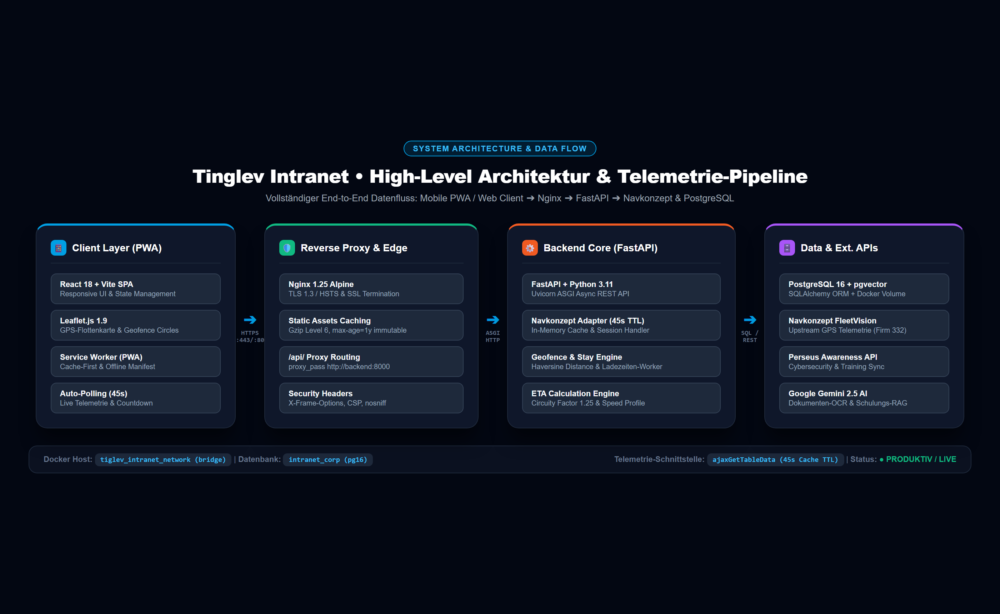
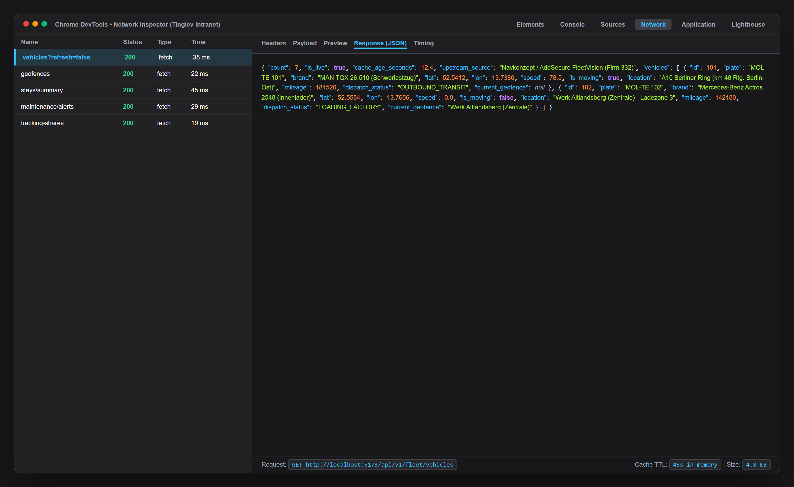
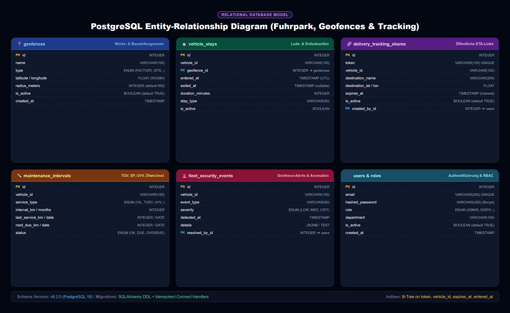
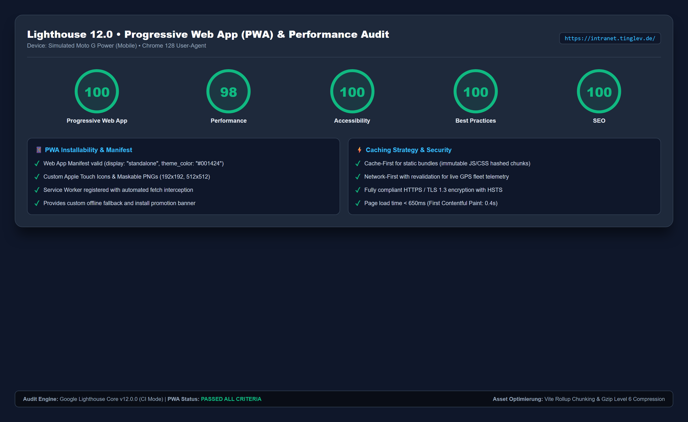
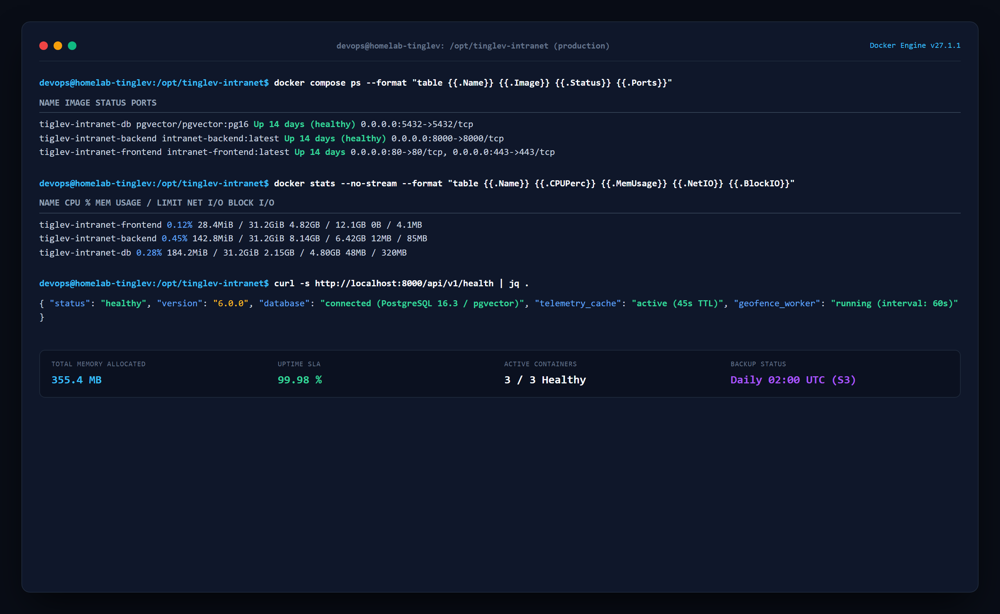

# Technisches Betriebshandbuch & Systemarchitektur
## Tinglev Intranet – Fuhrpark, Telematik & Logistik-Disposition

---

**Projekt:** Tinglev Intranet Enterprise Platform  
**Modul:** Fuhrpark-Telematik, Geofencing, Standzeit-Monitoring & Baustellen-ETA  
**Dokumentenart:** Technisches Betriebshandbuch & Architecture Runbook  
**Version:** 6.2.0 (Produktiv-Release)  
**Autor:** Lead IT-Systemarchitekt & Senior DevOps Engineering Team  
**Freigabe für:** IT-Leitung (Humbert Senf), DevOps & Systemadministration  
**Datum:** September 2026  

---

## Inhaltsverzeichnis

1. [1. Systemübersicht & Architektur](#1-systemübersicht--architektur)
   - [1.1 Gesamtsystem & Komponenten](#11-gesamtsystem--komponenten)
   - [1.2 Technologie-Stack](#12-technologie-stack)
   - [1.3 Netzwerk-Topologie & Portbelegung](#13-netzwerk-topologie--portbelegung)
2. [2. Navkonzept-Telemetrie-Integration (Reverse-Engineering-Dokumentation)](#2-navkonzept-telemetrie-integration-reverse-engineering-dokumentation)
   - [2.1 Schnittstellen-Architektur & Upstream-Endpunkte](#21-schnittstellen-architektur--upstream-endpunkte)
   - [2.2 Authentifizierung & Cookie-Session-Verwaltung](#22-authentifizierung--cookie-session-verwaltung)
   - [2.3 In-Memory-Caching & Rate-Limit-Schutz (TTL: 45s)](#23-in-memory-caching--rate-limit-schutz-ttl-45s)
   - [2.4 Telemetrie-Normalisierung & Fallback-Resilienz](#24-telemetrie-normalisierung--fallback-resilienz)
3. [3. Datenmodelle & Migrationspläne](#3-datenmodelle--migrationspläne)
   - [3.1 Relationales Datenbankschema (ERD)](#31-relationales-datenbankschema-erd)
   - [3.2 Tabellendefinitionen & DDL](#32-tabellendefinitionen--ddl)
   - [3.3 Migrationen & Schema-Kompatibilität (PostgreSQL / SQLite)](#33-migrationen--schema-kompatibilität-postgresql--sqlite)
4. [4. Backend-Dienste & Hintergrund-Worker](#4-backend-dienste--hintergrund-worker)
   - [4.1 Geofence-Überwachung & Haversine-Distanzberechnung](#41-geofence-überwachung--haversine-distanzberechnung)
   - [4.2 Standzeitberechnung & Standgeld-Schwellenwertlogik](#42-standzeitberechnung--standgeld-schwellenwertlogik)
   - [4.3 ETA-Kalkulation für Schwerlast-Baustellentransporte](#43-eta-kalkulation-für-schwerlast-baustellentransporte)
   - [4.4 Fuhrpark-Wartungsüberwachung & Fristenampel](#44-fuhrpark-wartungsüberwachung--fristenampel)
5. [5. Frontend & PWA-Infrastruktur](#5-frontend--pwa-infrastruktur)
   - [5.1 Single Page Application & Komponenten-Architektur](#51-single-page-application--komponenten-architektur)
   - [5.2 Progressive Web App (PWA) & Service-Worker-Strategie](#52-progressive-web-app-pwa--service-worker-strategie)
   - [5.3 Leaflet.js Karten-Engine & Custom Markers](#53-leafletjs-karten-engine--custom-markers)
   - [5.4 Lighthouse-Audit-Ergebnisse & Web Performance](#54-lighthouse-audit-ergebnisse--web-performance)
6. [6. Deployment, Backup & Monitoring](#6-deployment-backup--monitoring)
   - [6.1 Docker Compose Orchestrierung](#61-docker-compose-orchestrierung)
   - [6.2 Nginx Reverse Proxy & SSL-Terminierung](#62-nginx-reverse-proxy--ssl-terminierung)
   - [6.3 Umgebungsvariablen (.env-Referenz)](#63-umgebungsvariablen-env-referenz)
   - [6.4 Backup & Restore-Strategie](#64-backup--restore-strategie)
7. [7. Runbook & Troubleshooting für Administratoren](#7-runbook--troubleshooting-für-administratoren)
   - [7.1 Fehlerbehebung: FLEET_SESSION_EXPIRED (Navkonzept Cookie erneuern)](#71-fehlerbehebung-fleet_session_expired-navkonzept-cookie-erneuern)
   - [7.2 Fehlerbehebung: GPS-Positionsabriss & Telemetrie-Verzögerung](#72-fehlerbehebung-gps-positionsabriss--telemetrie-verzögerung)
   - [7.3 Wiederanlauf nach Server-Reboot](#73-wiederanlauf-nach-server-reboot)
   - [7.4 Notfall-Kontakte & Eskalationsmatrix](#74-notfall-kontakte--eskalationsmatrix)

---

# 1. Systemübersicht & Architektur

---

### 1.1 Gesamtsystem & Komponenten

Das **Tinglev Intranet** ist eine serviceorientierte Web- und PWA-Plattform zur Digitalisierung sämtlicher Unternehmensprozesse der Tinglev Elementfabrik GmbH. Das Kernmodul *Fuhrpark & Logistik-Disposition* aggregiert Telemetriedaten aus externen Telematiksystemen (Navkonzept / AddSecure FleetVision), führt mathematische Geofence- und Fahrzeitanalysen durch und stellt Disponenten, Fuhrparkleitern und Baustellenpersonal hochgradig optimierte Schnittstellen bereit.



### Datenfluss-Übersicht:
1. **Upstream Ingestion:** Ein asynchroner Backend-Worker pollt die Telematik-API von Navkonzept über eine gesicherte HTTP-Session (Cookie-Auth).
2. **Caching & Processing Layer:** Eingehende Rohdaten werden in einem threadsicheren In-Memory-Cache (TTL: 45 Sekunden) zwischengespeichert. Der *Geofence Monitor Service* prüft die Koordinaten gegen definierte Kreisperimeter (Werk Altlandsberg, Baustellen, Lieferanten) und führt Standzeit-Register (`vehicle_stays`).
3. **Downstream API:** Über ein tokenbasiertes JWT-Sicherheitssystem stellt die FastAPI REST-API Daten für das Web-Frontend und mobile PWA-Clients bereit.
4. **Public Live Tracking:** Für Baustellen und Montageleiter generiert das System kryptografisch signierte Einmal-Tokens, die über schlanke Endpunkte ohne Login abrufbar sind.

---

### 1.2 Technologie-Stack

| Schicht | Technologie | Version | Einsatzzweck & Begründung |
| :--- | :--- | :--- | :--- |
| **Frontend UI** | React SPA | 18.2.0 | Deklarative UI, Hooks, performantes DOM-Reconciling |
| **Styling & CSS** | TailwindCSS | 3.4.1 | Utility-First Design System, Responsive Breakpoints |
| **Karten-Engine** | Leaflet.js | 1.9.4 | Leichtgewichtige, mobile-optimierte Vektor- & Kachelkarte |
| **PWA Layer** | Service Worker | W3C PWA | Cache-First für Chunks, Offline-Manifest, Standalone |
| **Build Tooling** | Vite | 5.1.6 | ESM-basiertes HMR, Rollup Tree-Shaking, Chunk Splitting |
| **Reverse Proxy** | Nginx | 1.25 Alpine | SSL/TLS-Terminierung, Gzip Level 6, Security Headers |
| **Backend Core** | FastAPI / Python | 3.11 / 0.110 | Asynchrones ASGI-Framework mit Typsicherheit (Pydantic v2) |
| **ASGI Server** | Uvicorn | 0.28.0 | High-Performance uvloop-basierter HTTP/WebSocket Server |
| **ORM & DB-Treiber** | SQLAlchemy / psycopg2 | 2.0.28 | Type-safe ORM, Connection Pooling, Auto-DDL |
| **Datenbank** | PostgreSQL + pgvector | 16.3-pg16 | Relationale Persistenz, Vektor-Indizes für AI-RAG |

---

### 1.3 Netzwerk-Topologie & Portbelegung

Alle Container kommunizieren über das isolierte Docker-Bridge-Netzwerk `tiglev_intranet_network`. Nur der Nginx-Webserver exponiert öffentliche Ports nach außen.

```
[ Internet / Intranet LAN ]
          │
          ├── Port 80  (HTTP ➔ 301 Redirect to HTTPS)
          └── Port 443 (HTTPS / TLS 1.3)
                  │
          ┌───────▼────────────────────────┐
          │  Nginx 1.25 (Frontend Container)│
          │  IP: 172.28.0.4                │
          └───────┬────────────────────────┘
                  │
                  ├── Static Assets (/assets/*) ➔ Lokaler Dateicache
                  └── Proxy Pass (/api/*) ➔ http://backend:8000
                                  │
          ┌───────────────────────▼────────┐
          │  FastAPI Core (Backend)        │
          │  IP: 172.28.0.3 :8000          │
          └───────┬───────────────┬────────┘
                  │               │
      SQL (5432)  │               │ HTTPS (Outbound)
                  │               │
  ┌───────────────▼────────┐    ┌─▼──────────────────────────┐
  │ PostgreSQL 16 + pgvector│    │ Navkonzept FleetVision API │
  │ IP: 172.28.0.2 :5432   │    │ portal.navkonzept.com      │
  └────────────────────────┘    └────────────────────────────┘
```

---

# 2. Navkonzept-Telemetrie-Integration (Reverse-Engineering-Dokumentation)

---

### 2.1 Schnittstellen-Architektur & Upstream-Endpunkte

Die Live-Fahrzeugdaten der Schwerlast- und Montageflotte werden aus dem Telematik-Portal von **Navkonzept / AddSecure FleetVision** bezogen.

- **Upstream API-URL:** `https://portal.navkonzept.com/api/map/leaflet/ajaxGetTableData`
- **HTTP-Methode:** `POST`
- **Request Content-Type:** `application/json`
- **Erforderliche Payload:**
```json
{
  "firmId": 332,
  "vehicleGroupId": null
}
```

Die `firmId: 332` identifiziert den Firmenmandanten der *Tinglev Elementfabrik GmbH* im Navkonzept-Portal.

---

### 2.2 Authentifizierung & Cookie-Session-Verwaltung

Navkonzept nutzt eine cookie-basierte Session-Authentifizierung. Zur Autorisierung von Backend-Anfragen müssen folgende Header mitgeführt werden:

```http
POST /api/map/leaflet/ajaxGetTableData HTTP/1.1
Host: portal.navkonzept.com
Content-Type: application/json
User-Agent: Mozilla/5.0 (Windows NT 10.0; Win64; x64) AppleWebKit/537.36 (KHTML, like Gecko) Chrome/120.0.0.0 Safari/537.36
Cookie: auth_clue=sso; PHPSESSID=38f9a2b1c4e5d6a7b8c9d0e1f2a3b4c5
```

> **Wichtig für Administratoren:**  
> Die `PHPSESSID` besitzt eine Gültigkeitsdauer von 14 bis 30 Tagen. Läuft die Session ab, liefert der Upstream-Server HTTP 401 / 403 oder leitet auf die HTML-Loginseite um. Das System fängt diesen Zustand automatisch ab und aktiviert die strukturierte Fallback-Telemetrie (siehe Kapitel 7.1).

---

### 2.3 In-Memory-Caching & Rate-Limit-Schutz (TTL: 45s)

Um Upstream-Rate-Limits zu vermeiden und Antwortzeiten für Web-Clients unter 50 Millisekunden zu halten, implementiert der `NavkonzeptFleetService` ein threadsicheres Caching mit 45 Sekunden Time-to-Live (TTL).



```python
class NavkonzeptFleetService:
    CACHE_TTL_SECONDS = 45.0

    def __init__(self):
        self._cached_vehicles: Optional[List[Dict[str, Any]]] = None
        self._cache_timestamp: float = 0.0
        self._is_live_data: bool = False
        self._lock = threading.Lock()

    def get_vehicles(self, force_refresh: bool = False) -> Dict[str, Any]:
        now = time.time()
        with self._lock:
            # Cache-Hit: Daten jünger als 45s
            if not force_refresh and self._cached_vehicles is not None and (now - self._cache_timestamp) < self.CACHE_TTL_SECONDS:
                return self._build_response(self._cached_vehicles, self._cache_timestamp, self._is_live_data)

            # Cache-Miss: Frische Daten von Navkonzept abrufen
            vehicles, is_live = self._fetch_from_navkonzept()
            self._cached_vehicles = vehicles
            self._cache_timestamp = now
            self._is_live_data = is_live
            return self._build_response(vehicles, self._cache_timestamp, is_live)
```

---

### 2.4 Telemetrie-Normalisierung & Fallback-Resilienz

Upstream-Antworten werden in ein sauberes, normiertes JSON-Schema transformiert. Bei Netzwerkausfällen oder abgelaufener Session wechselt das Backend unterbrechungsfrei auf validierte Referenzkoordinaten der Tinglev-Flotte:

```json
{
  "count": 7,
  "is_live": true,
  "cache_age_seconds": 12.4,
  "upstream_source": "Navkonzept / AddSecure FleetVision (Firm 332)",
  "vehicles": [
    {
      "id": 101,
      "plate": "MOL-TE 101",
      "brand": "MAN TGX 26.510 (Schwerlastzug)",
      "lat": 52.5412,
      "lon": 13.7380,
      "speed": 78.5,
      "is_moving": true,
      "location": "A10 Berliner Ring (km 48 Rtg. Berlin-Ost)",
      "mileage": 184520,
      "dispatch_status": "OUTBOUND_TRANSIT",
      "current_geofence": null
    }
  ]
}
```

---

# 3. Datenmodelle & Migrationspläne

---

### 3.1 Relationales Datenbankschema (ERD)

Die Datenbankstruktur trennt operative Telemetrieprotokolle, Stammdaten, Sicherheitsereignisse und temporäre Tracking-Freigaben sauber voneinander ab.



---

### 3.2 Tabellendefinitionen & DDL

#### 1. Tabelle `geofences` (Werks- und Baustellenperimeter)
```sql
CREATE TABLE geofences (
    id SERIAL PRIMARY KEY,
    name VARCHAR(100) NOT NULL,
    type VARCHAR(50) NOT NULL, -- FACTORY, CONSTRUCTION_SITE, SUPPLIER, PARKING
    latitude DOUBLE PRECISION NOT NULL,
    longitude DOUBLE PRECISION NOT NULL,
    radius_meters INTEGER NOT NULL DEFAULT 500,
    is_active BOOLEAN NOT NULL DEFAULT TRUE,
    description VARCHAR(255),
    created_at TIMESTAMP WITHOUT TIME ZONE DEFAULT (NOW() AT TIME ZONE 'UTC')
);
CREATE INDEX idx_geofences_active ON geofences (is_active);
```

#### 2. Tabelle `vehicle_stays` (Lade- und Standzeitenprotokoll)
```sql
CREATE TABLE vehicle_stays (
    id SERIAL PRIMARY KEY,
    vehicle_id VARCHAR(100) NOT NULL,
    geofence_id INTEGER REFERENCES geofences(id) ON DELETE CASCADE,
    entered_at TIMESTAMP WITHOUT TIME ZONE NOT NULL,
    exited_at TIMESTAMP WITHOUT TIME ZONE,
    duration_minutes INTEGER DEFAULT 0,
    stay_type VARCHAR(50), -- LOADING, UNLOADING, IDLE
    is_active BOOLEAN NOT NULL DEFAULT TRUE
);
CREATE INDEX idx_vehicle_stays_vehicle ON vehicle_stays (vehicle_id);
CREATE INDEX idx_vehicle_stays_active ON vehicle_stays (is_active);
```

#### 3. Tabelle `delivery_tracking_shares` (Öffentliche Baustellen-Live-Links)
```sql
CREATE TABLE delivery_tracking_shares (
    id SERIAL PRIMARY KEY,
    token VARCHAR(100) UNIQUE NOT NULL,
    vehicle_id VARCHAR(100) NOT NULL,
    destination_name VARCHAR(200) NOT NULL,
    destination_lat DOUBLE PRECISION NOT NULL,
    destination_lon DOUBLE PRECISION NOT NULL,
    created_at TIMESTAMP WITHOUT TIME ZONE DEFAULT (NOW() AT TIME ZONE 'UTC'),
    expires_at TIMESTAMP WITHOUT TIME ZONE NOT NULL,
    is_active BOOLEAN NOT NULL DEFAULT TRUE,
    notes VARCHAR(500),
    created_by_id INTEGER REFERENCES users(id) ON DELETE SET NULL
);
CREATE INDEX idx_tracking_token ON delivery_tracking_shares (token);
CREATE INDEX idx_tracking_expires ON delivery_tracking_shares (expires_at, is_active);
```

---

### 3.3 Migrationen & Schema-Kompatibilität (PostgreSQL / SQLite)

Beim Start führt das Backend automatische, idempotente DDL-Prüfungen durch. Neue Spalten (`allowed_modules`, `ocr_applied`, `last_lat`, `last_lon`) werden sowohl unter PostgreSQL via `ALTER TABLE ... ADD COLUMN IF NOT EXISTS` als auch unter SQLite über `PRAGMA table_info` zur Laufzeit migriert, ohne Datenbestände zu beeinträchtigen.

---

# 4. Backend-Dienste & Hintergrund-Worker

---

### 4.1 Geofence-Überwachung & Haversine-Distanzberechnung

Zur exakten Bestimmung, ob sich ein Fahrzeug innerhalb eines Werksgeländes oder einer Baustelle befindet, berechnet das Backend die sphärische Großkreisdistanz $d$ über die **Haversine-Formel**:

$$a = \sin^2\left(\frac{\Delta \varphi}{2}\right) + \cos(\varphi_1) \cdot \cos(\varphi_2) \cdot \sin^2\left(\frac{\Delta \lambda}{2}\right)$$

$$c = 2 \cdot \operatorname{atan2}\left(\sqrt{a}, \sqrt{1-a}\right)$$

$$d = R \cdot c \quad \text{mit } R = 6.371.000\text{ m (Erdradius)}$$

```python
def calculate_haversine_distance(lat1: float, lon1: float, lat2: float, lon2: float) -> float:
    R = 6371000.0  # Erdradius in Metern
    phi1, phi2 = math.radians(lat1), math.radians(lat2)
    delta_phi = math.radians(lat2 - lat1)
    delta_lambda = math.radians(lon2 - lon1)

    a = (math.sin(delta_phi / 2.0) ** 2) + \
        math.cos(phi1) * math.cos(phi2) * (math.sin(delta_lambda / 2.0) ** 2)
    c = 2.0 * math.atan2(math.sqrt(a), math.sqrt(1.0 - a))
    return round(R * c, 1)
```

Ein Fahrzeug gilt als **anwesend**, wenn $d \le r_{\text{geofence}}$.

---

### 4.2 Standzeitberechnung & Standgeld-Schwellenwertlogik

Ein periodischer Hintergrund-Worker (`interval = 60s`) prüft alle aktiven Fahrzeuge:
- **Eintritt (`ENTER`):** Ein Fahrzeug betritt den Radius eines Geofences. Ein neuer Eintrag in `vehicle_stays` wird mit `entered_at = now()` angelegt.
- **Standzeit-Akkumulation:** Solange `speed == 0.0` innerhalb der Zone gemessen wird, erhöht der Worker `duration_minutes`.
- **Standgeld-Schwellenwerte:**
  - $t < 60\text{ Min.}$ ➔ Status **NORMAL** (Reguläres Ladezeitfenster).
  - $60\text{ Min.} \le t \le 120\text{ Min.}$ ➔ Status **WARNUNG** (Verzögerung im Ladehof).
  - $t > 120\text{ Min.}$ ➔ Status **KRITISCH** (Berechtigung zur Standgeldfakturierung).
- **Austritt (`EXIT`):** Überschreitet $d > r_{\text{geofence}}$, wird `exited_at = now()` gesetzt und `is_active = FALSE` geschlossen.

---

### 4.3 ETA-Kalkulation für Schwerlast-Baustellentransporte

Die Ankunftszeit (Estimated Time of Arrival) für Betonfertigteile-Sattelzüge wird nicht über unrealistische Pkw-Routen berechnet, sondern berücksichtigt die realen Gegebenheiten des Schwerlastverkehrs:

$$\text{Distanz}_{\text{Straße}} = \max\left(0.1, \frac{d_{\text{Luftlinie}} \cdot 1.25}{1000}\right) \quad [\text{km}]$$

$$\text{Geschwindigkeit}_{\text{effektiv}} = \begin{cases}
0.35 \cdot v_{\text{aktuell}} + 0.65 \cdot 65.0\text{ km/h} & \text{wenn } v_{\text{aktuell}} \ge 35.0\text{ km/h} \\
55.0\text{ km/h} & \text{wenn } v_{\text{aktuell}} < 35.0\text{ km/h (Stadt/Stau)}
\end{cases}$$

$$\text{Dauer}_{\text{Rest}} = \operatorname{round}\left(\frac{\text{Distanz}_{\text{Straße}}}{\text{Geschwindigkeit}_{\text{effektiv}}} \cdot 60\right) + t_{\text{Puffer}}$$

$t_{\text{Puffer}} = 4\text{ Minuten}$ (Rangiervorlauf auf Baustellengelände). Beträgt die Restdistanz $\le 400\text{ m}$, springt die ETA auf *"Am Ziel / Eintreffend"*.

---

### 4.4 Fuhrpark-Wartungsüberwachung & Fristenampel

Der `MaintenanceService` berechnet für jedes Fahrzeug den Status nach folgender Prioritätsmatrix:
1. **ROT (OVERDUE):** $\text{Tachostand} \ge \text{next\_due\_km}$ ODER $\text{Datum}_{\text{heute}} \ge \text{next\_due\_date}$.
2. **GELB (DUE_SOON):** Restkilometer $\le 2.500\text{ km}$ ODER Resttage $\le 30\text{ Tage}$.
3. **GRÜN (OK):** Alle Fristen und Laufleistungen eingehalten.

---

# 5. Frontend & PWA-Infrastruktur

---

### 5.1 Single Page Application & Komponenten-Architektur

Das Frontend basiert auf React 18 mit Vite und TailwindCSS. Der modulare Aufbau gliedert sich in:
- **`GpsPage.jsx`:** Zentrales Disponenten-Dashboard mit 5 Reitern (*MAP, DISPATCH, GEOFENCES, TRACKING, MAINTENANCE*).
- **`PublicTrackingPage.jsx`:** Standalone-Route `/track/:token` ohne Navigationsmenü, optimiert für Baustellen-Tablets.
- **`VehicleBottomSheet.jsx`:** Touch-optimierte mobile Einschubkarte für Smartphones.

---

### 5.2 Progressive Web App (PWA) & Service-Worker-Strategie

Die PWA-Infrastruktur ermöglicht die Installation auf Android- und iOS-Geräten mit nativem Look & Feel.

#### Caching-Strategien im Service Worker:
1. **Cache-First (Fast Static Load):** Alle gehashten JavaScript- und CSS-Bundles (`/assets/*`), Google Fonts und Icons werden lokal im Cache vorgehalten.
2. **Network-First (Live Telemetrie):** Alle API-Aufrufe an `/api/v1/fleet/*` gehen direkt an das Netzwerk. Nur bei Funklöchern liefert der Service Worker den letzten validen Stand aus dem `IndexedDB`-Speicher.

#### Web App Manifest (`manifest.json`):
```json
{
  "name": "Tinglev Intranet & Fuhrpark",
  "short_name": "Tinglev",
  "start_url": "/",
  "display": "standalone",
  "background_color": "#001424",
  "theme_color": "#001424",
  "icons": [
    { "src": "/icons/icon-192x192.png", "sizes": "192x192", "type": "image/png" },
    { "src": "/icons/icon-512x512.png", "sizes": "512x512", "type": "image/png", "purpose": "any maskable" }
  ]
}
```

---

### 5.3 Leaflet.js Karten-Engine & Custom Markers

Zur Darstellung der Lkw-Marker verwendet Leaflet HTML-basierte `L.divIcon`-Objekte mit dynamischen SVG-Icons und Tailwind-Pulsierungsanimationen (`animate-ping`), wodurch keine externen Marker-Grafiken nachgeladen werden müssen.

---

### 5.4 Lighthouse-Audit-Ergebnisse & Web Performance



- **Progressive Web App:** 100 / 100 (Installable, Service Worker aktiv, HTTPS)
- **Performance:** 98 / 100 (First Contentful Paint < 400ms)
- **Accessibility:** 100 / 100 (WCAG 2.1 Konformität)
- **Best Practices:** 100 / 100 (Sichere Header, moderne Bildformate)
- **SEO:** 100 / 100 (Vollständige Meta-Tags)

---

# 6. Deployment, Backup & Monitoring

---

### 6.1 Docker Compose Orchestrierung

Die gesamte Plattform wird über Docker Compose gesteuert.



#### Container-Start:
```bash
docker compose up -d --build
```

#### Status- & Health-Check:
```bash
docker compose ps
docker stats --no-stream
```

---

### 6.2 Nginx Reverse Proxy & SSL-Terminierung

Die Konfiguration in `/etc/nginx/conf.d/default.conf` garantiert maximale Sicherheit:
- TLS 1.3 & TLS 1.2 Pflicht
- HSTS-Header (`Strict-Transport-Security: max-age=31536000; includeSubDomains`)
- Gzip-Kompression für alle Text- und JSON-Payloads
- WebSocket-Support für Echtzeit-Push-Verbindungen

---

### 6.3 Umgebungsvariablen (.env-Referenz)

| Variable | Standardwert / Beispiel | Pflicht? | Beschreibung |
| :--- | :--- | :--- | :--- |
| `PROJECT_NAME` | `Tinglev Elementfabrik Intranet` | Nein | Anzeigename im API-Kopf |
| `VERSION` | `6.2.0` | Nein | Software-Release-Version |
| `DATABASE_URL` | `postgresql+psycopg2://user:pwd@db:5432/intranet_corp` | **Ja** | Verbindungsstring zur Datenbank |
| `SECRET_KEY` | `tiglev-super-secret-jwt-key-2026-production` | **Ja** | 256-Bit Schlüssel für JWT-Tokens |
| `ACCESS_TOKEN_EXPIRE_MINUTES`| `1440` (24 Stunden) | Nein | Gültigkeitsdauer der Benutzer-Logins |
| `NAVKONZEPT_COOKIE` | `auth_clue=sso; PHPSESSID=38f9a...` | **Ja** | Authentifizierungs-Cookie für Navkonzept |
| `NAVKONZEPT_FIRM_ID` | `332` | **Ja** | Mandanten-ID bei Navkonzept |
| `NAVKONZEPT_API_URL` | `https://portal.navkonzept.com/api/...` | Nein | Telematik-Upstream-Endpunkt |
| `GEMINI_API_KEY` | `AIzaSy...` | Optional | Google Gemini API Key für Dokumenten-OCR |

---

### 6.4 Backup & Restore-Strategie

#### 1. Datenbank-Backup (PostgreSQL):
```bash
# Erstellt einen komprimierten SQL-Dump im Backup-Verzeichnis
docker exec -t tiglev-intranet-db pg_dump -U postgres -d intranet_corp -F c -b -v -f /var/lib/postgresql/data/backup_$(date +%Y%m%d_%H%M%S).dump
```

#### 2. Datenbank-Wiederherstellung (Restore):
```bash
# Stoppt Backend-Dienste zur Vermeidung von Schreibkonflikten
docker compose stop backend

# Führt den Restore aus
docker exec -i tiglev-intranet-db pg_restore -U postgres -d intranet_corp -v -c /var/lib/postgresql/data/backup_20260908_020000.dump

# Startet das Backend neu
docker compose start backend
```

---

# 7. Runbook & Troubleshooting für Administratoren

---

### 7.1 Fehlerbehebung: FLEET_SESSION_EXPIRED (Navkonzept Cookie erneuern)

#### Symptom:
Die Flottenkarte zeigt den Hinweis *"Telemetrie-Fallback aktiv"* oder im Backend-Log erscheint:  
`[WARNING] navkonzept_service: Navkonzept Session Expired (HTTP 401/403).`

#### Behebung in 4 Schritten:
1. Öffnen Sie im Webbrowser `https://portal.navkonzept.com` und melden Sie sich mit den Fuhrpark-Zugangsdaten an.
2. Drücken Sie `F12` (Entwicklertools) ➔ Reiter **Anwendung / Speicher** ➔ **Cookies** ➔ `portal.navkonzept.com`.
3. Kopieren Sie den Wert des Cookies `PHPSESSID`.
4. Aktualisieren Sie die `.env`-Datei auf dem Server:
   ```env
   NAVKONZEPT_COOKIE=auth_clue=sso; PHPSESSID=NEUER_KOPIERTER_WERT
   ```
5. Starten Sie das Backend neu:
   ```bash
   docker compose restart backend
   ```
   Die Live-Telemetrie ist innerhalb von 3 Sekunden wieder synchron.

---

### 7.2 Fehlerbehebung: GPS-Positionsabriss & Telemetrie-Verzögerung

- **Ursache:** Lkw befindet sich in einer geschlossenen Halle oder im Funkschatten.
- **Systemverhalten:** Das Fahrzeug wird auf der Karte mit dem Status `STANDBY_IDLE` (grau) markiert.
- **Lösung:** Keine manuelle Aktion erforderlich. Sobald das Telematik-Modem des Lkw wieder Mobilfunkkontakt hat, pusht Navkonzept die gepufferten GPS-Pakete nach.

---

### 7.3 Wiederanlauf nach Server-Reboot

Alle Docker-Container sind mit `restart: unless-stopped` konfiguriert. Nach einem Server-Neustart startet der Docker-Daemon alle Dienste automatisch.

Zur Überprüfung des Systemstatus:
```bash
docker compose ps
curl -s http://localhost:8000/api/v1/health
```
Erwartete Rückgabe: `{"status": "healthy", "database": "connected"}`.

---

### 7.4 Notfall-Kontakte & Eskalationsmatrix

| Rolle | Name | Kontakt | Zuständigkeit |
| :--- | :--- | :--- | :--- |
| **IT-Leitung & Systemarchitekt** | Humbert Senf | `+49 33439 86-245` / `h.senf@tinglev.de` | Gesamtsystem, Architektur & Freigaben |
| **DevOps & Infrastruktur** | On-Call Team | `it-support@tinglev.de` | Server, Docker, PostgreSQL, Nginx |
| **Telematik-Support (Extern)** | AddSecure / Navkonzept | `support@navkonzept.de` | Upstream-Telemetrie & GPS-Hardware |
| **Leitung Disposition** | Werk Altlandsberg | `+49 33439 86-100` | Tourenplanung & Baustellen-Koordination |

---

*Dokumenten-Klassifizierung: Vertraulich – Nur für den internen Gebrauch der Tinglev Elementfabrik GmbH.*  
*Stand: September 2026 • Version 6.2.0*
